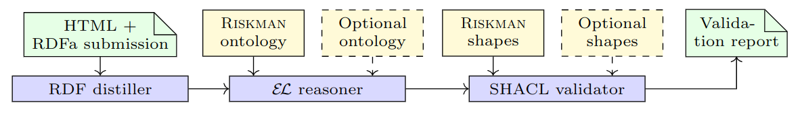

# Riskman validation pipeline


## Setup


```bash
# Create virtual environment named 'kimeds'
# IMPORTANT: make sure the python version is 3.11
python -m venv kimeds_env


# Activate the virtual environment (for macOS/Linux)
source kimeds_env/bin/activate

# Activate the virtual environment (for Windows)
# riskman\Scripts\activate

# Update pip
pip install --upgrade pip

# Install dependencies from requirements.txt
pip install -r requirements.txt

# Download latest ontology and shapes
wget -O ontology.ttl https://w3id.org/riskman/ontology
wget -O shapes.ttl https://w3id.org/riskman/shapes
```




### RDFa distillation:

```
cat submission_correct.html | ./rdf_distiller.sh 
```

### ABox validation

```
cat test-cases/corr.ttl ontology.ttl | ./reasoner.sh | ./validator.sh shapes.ttl 
cat test-cases/1missing-im.ttl ontology.ttl | ./reasoner.sh | ./validator.sh shapes.ttl 
cat test-cases/2assurance-sda.ttl ontology.ttl | ./reasoner.sh | ./validator.sh shapes.ttl 

```


### Catching errors:
1.  Missing implementation manifest (file [1missing-im.ttl](test/1missing-im.ttl), violating `SDAShape`) 

      ```
      cat test/1missing-im.ttl ontology.ttl | ./prob_sev.sh -p 5 -s 5 | ./reasoner.sh | ./validator.sh shapes.ttl   
      ```

      Explanation: `ex:sda121` is a leaf SDA and has no implementation manifest.

2. Child of an AssuranceSDA not an AssuranceSDA (file [2assurance-sda.ttl](test/2assurance-sda.ttl), violating `AssuranceSDAShape`)
      ```
      cat test/2assurance-sda.ttl ontology.ttl | ./prob_sev.sh -p 5 -s 5 | ./reasoner.sh | ./validator.sh shapes.ttl   
      ```
      Explanation: `ex:sda991` is a child of an AssuranceSDA but is missing the safety assurance so it's itself not an AssuranceSDA. Therefore the requirement that subtree rooted at an AssuranceSDA must again be created from AssuranceSDAs is violated. 

3. Specifying all 3 probabilities, P != P1 x P2 (file [3probability-product.ttl](test/3probability-product.ttl), violating `RiskLevelShape`)
      ```
      cat test/3probability-product.ttl ontology.ttl | ./prob_sev.sh -p 5 -s 5 | ./reasoner.sh | ./validator.sh shapes.ttl   
      ```
      `initialRiskLevel2` specifies all 3 probabilities, i.e.:
         P=4,
         P1=4,
         P2=4.
        Inference gives product to be P=3, and this violates the constraint that each RiskLevel must have exactly one `hasProbability` successor.


4. Residual probability higher than initial. (file [4residual-prob.ttl](test/4residual-prob.ttl), violating `NonIncreasingProbabilityShape`)
      ```
      cat test/4residual-prob.ttl ontology.ttl | ./prob_sev.sh -p 5 -s 5 | ./reasoner.sh | ./validator.sh shapes.ttl   
      ```

      `initialRiskLevel1` specifies probability P as 2 whereas `residualRiskLevel1` specifies probability P as 3. The former is the initial probability of the (AnalyzedRisk of the) `controlledRisk1` and the latter is its residual risk level.


## Running the pipeline

Generally, the pipeline is run with the following chain of commands:

```
cat <HTML SUBMISSION FILE> | ./rdf_distiller.sh | cat - <ONTOLOGY FILE> | ./reasoner.sh | ./validator.sh <SHAPES FILE>
```

- `cat <SUBMISSION FILE>` echo the contents of the `<SUBMISSION FILE>` file, an HTML file with RDFa annotations
- `| ./rdf_distiller.sh` extract the RDF triples from the HTML file
- `| cat - <ONTOLOGY FILE>` combine the extracted triples with the appropriate riskman ontology `<ONTOLOGY FILE>`
- `| ./reasoner.sh` apply inference, realize the ontology
- `| ./validator.sh <SHAPES FILE>` validate against the shapes `<SHAPES FILE>`
``
